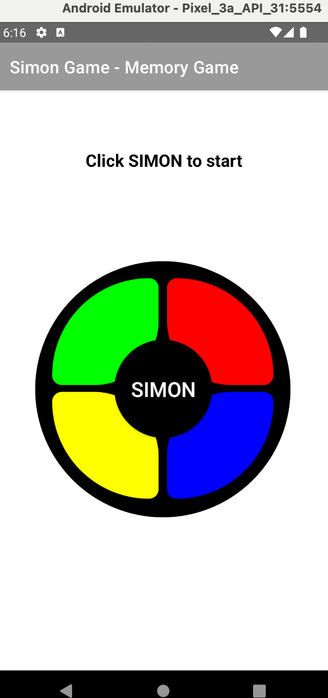

# Simon Game Android App
#### An Android app of Simon game, based on the classic memory game toy.

#### By Morgan Waites

## Technologies Used

* Java
* Android Studio

## Description
The toy image has four different colors that light up in a pattern that gets progressively longer and more difficult to copy with each round. User must copy by clicking same colors each round. This goes on for up to infinite rounds! Though no one could probably get to even 100.

## Setup/Installation Requirements

* Buit in Android Studio, requires Android Studio to run project folder

## Known Bugs

* Tested for Pixel 3, 4 system/devices, sizing, margins off for other devices, needs work on optimization, for instance, when run on Galaxy Nexus emulator, restart text at bottom not visible/cut off.
* Not production ready. Need to deploy on Google Play but reluctant to pay the $25 account fee.

## License

[MIT](https://opensource.org/licenses/MIT) Copyright 2021 Morgan Waites.

